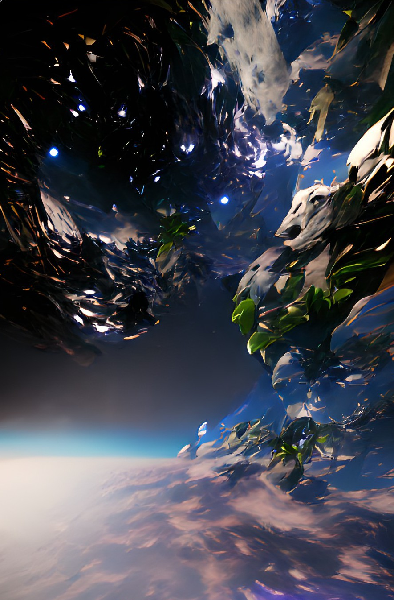

# [Wombo AI Scraper](https://app.wombo.art/)

This script is simply made to scrape the [Wombo AI](https://app.wombo.art/) website and save the images in a folder.


## ⬇️ Download

```bash
git clone https://github.com/YungBricoCoop/WomboAiScraper.git
cd WomboAiScraper
pip install -r requirements.txt
```
## ⚠️ Warning

This script use selenium so make sure you specifies the **path**(LINE 16 in the script) to your **chromedriver**.

The Wombo website is subject to change so you might need to update the XPATH requests to find elements on the page.

If you make to many requests to the website, you might get timed out to.

## ✔️ Usage

First you can edit the categories if you want on **line 25**. By default categories are: ["Mystical","HD","Synthwave","Vibrant"]

To start the script you just need to run the following command : <code>python womboAiScraper.py </code>
Then you need to answer the questions : 
```python
> What do you want to generate with AI : Space
> Number of iterations : 1
```

Voila ! In my case the generated images are stored in the folder **Space** (Name of what i wanted to generate), see the result in the next chapter. 

## 👍 Result

>## Mystical 


>## HD 


>## Synthwave 


>## Vibrant 

